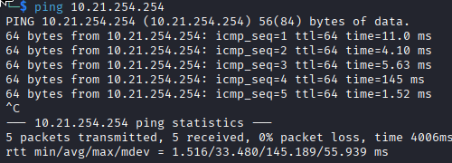

# TestOteria

# Vérifier son IP

*Commandes pour vérifier son IP et l'IP du routeur  :

```terminal
ifconfig
```


# Ping son routeur

**192.168.1.1 ( Adresse par défaut du routeur )

*10.21.154.254 ici*



Connexion établie avec le routeur

## Vérifier sa connexion vers DNS 

```terminal
ping 1.1.1.1

ou 

ping google.com
```


Si lors de l’exécution de l'une des commandes citées ci dessus 
le message suivant apparaît, alors la connexion est établie


